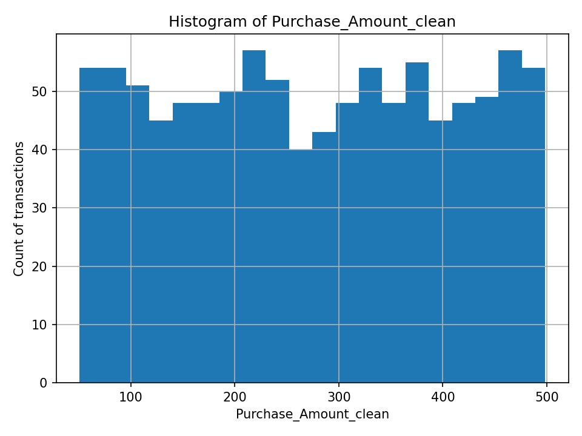

# ids706_de_project1_kaggle
Data Engineering multi-week assignment incorporating data import, data cleansing, exploratory analysis, predictive modelling, visualisation, and evaluation

**Conceptual Workflow**
flowchart
  A[Ingest CSV] --> B[Clean]
  B --> C[EDA]
  C --> D[Plot]
  C --> E[Model (baseline)]
  B -->|writes| P[data/processed/*]
  C & D & E -->|write| F[artifacts/*]
  
  **What each stage does in this version:**
  Ingest: read the committed CSV.
  Clean (src/data_clean.py):
    Normalize Purchase_Amount to float (strip $, commas).
    Normalize Time_of_Purchase with mixed mm/dd/yyyy / mm-dd-yyyy into Purchase_Date + date parts (Year/Month/Day/DayOfWeek).
  EDA (src/eda.py):
    Head / Info / Describe (numeric/bool only).
    Missing values & duplicate counts.
    Filtering: top-10% orders by Purchase_Amount_clean (p90 threshold).
    Grouping: per Purchase_Category summary: count, avg amount, avg satisfaction, discount rate.
    Outputs: CSV/TXT files in artifacts/ (no Markdown dependency).
  Plot (src/plot.py):
    One labeled histogram of Purchase_Amount_clean → artifacts/hist_purchase_amount.png
  Model (src/model.py):
    Simple numeric-only Logistic Regression predicting Discount_Used.
    No encoders; train/test split; accuracy reported.
  Output: artifacts/model_report.txt
  Tests (src/test_cases.py):
    Two unit tests for the model entrypoint (train_on_df), using synthetic data.
    Tests avoid file I/O via write_artifacts=False.
**Repository Structure (folders) & Why**
src/
  __init__.py
  data_clean.py        # cleaning & normalized dates/amount
  eda.py               # EDA -> CSV/TXT artifacts
  plot.py              # one histogram
  model.py             # super-simple baseline model
  test_cases.py        # unit tests (kept under src/ for this assignment)
data/
  Ecommerce_Consumer_Behavior_Analysis_Data.csv   # small 1k rows, committed for reproducibility
artifacts/              # generated outputs (git-ignored not in repo will generate files when run in local)
.github/workflows/ci.yml
requirements.txt
Makefile                # optional helper targets (if used)
.gitignore
README.md

src/ as a package makes python -m src.<module> work everywhere, in dev and CI.
data/ keeps a tiny CSV so the modules can be run without credentials.
artifacts/ and data/processed/ are git-ignored to keep the repo small and clean. A set of outputs have been added to the artefacts folder for reference.
https://github.com/PinakiG-duke/ids706_de_project1_kaggle/tree/main/artifacts
Tests live under src/ only for this assignment to simplify grading; in production they’d move to tests/.

**Branch Strategy (feature branches)**
main – stable code.
feat/cleaning – data cleaning slice (merged).
feat/eda – EDA slice.
feat/plot – visualization slice.
feat/model – baseline model slice.
feat/tests – unit tests stacked on the model branch.
ci/* – workflow tweaks if needed.

The branches are split by different components of the data science model and hence can keep main stable and debugging/ updates more systematic and trackable

**Continuous Integration**
This repo uses GitHub Actions (.github/workflows/ci.yml):
On push/PR: set up Python, install requirements.txt, run pytest.
Optional artifacts job: if the CSV is present on the branch, CI runs src.eda, src.plot, and src.model

**Run Output for each stage**
# Clean (writes processed CSV )
python -m src.data_clean

# EDA (writes CSV/TXT summaries)
python -m src.eda
# artifacts/eda_head.csv, eda_info.txt, eda_describe.csv, eda_missing.csv, eda_duplicates.txt,
# eda_filter_stats.csv (p75 threshold) & eda_category_summary.csv
https://github.com/PinakiG-duke/ids706_de_project1_kaggle/tree/main/artifacts (Sample outputs from a local run added for reference)

# Plot (one histogram)
python -m src.plot
# artifacts/hist_purchase_amount.png

# Model (baseline numeric-only)
python -m src.model
# artifacts/model_report.txt

**Notes on Reproducibility**
Committed data: a small (1k rows) CSV is checked in to ensure that the project can run with zero setup.
Randomness: model uses a fixed random_state to keep results stable.

**Dataset & Attribution**
Source: E-commerce dataset (1k rows)- https://www.kaggle.com/datasets/salahuddinahmedshuvo/ecommerce-consumer-behavior-analysis-data
File: data/raw/Ecommerce_Consumer_Behavior_Analysis_Data.csv
No PII handling.
_Use of OpenAI_
I used OpenAI to assist with:
1. Boilerplate codes (module outlines, Makefile targets, YAML starter),
2. Specific data-cleaning patterns (currency/commas, mixed date formats),
3. EDA conversion to CSV/TXT artifacts,
4. Parts of the minimal logistic regression model, and unit tests that are easy to grade,
5. Git/GitHub workflow guidance (CI YAML).
I made the design choices (dataset selection, filter, attributes to the model, repository/branch organization) and customized the code and syntax to fit the requirements. All code was reviewed, run locally, and adjusted by me to handle any runtime errors.

**Future Versions Plan**
All the stages from data ingestion, cleaning, EDA, Visualization, Model, Testing and CI/CD is kept very lightweight with no Data Access and security features. In subsequent versions, the objective is to move towards more production grade components such as : Ingestion from cloud location or database to be tried, EDA to include visual importance and correlation maps, Cleaning to include better outlier identification and handling, Visualisation on small dashboards built according to an analysis flow- Insights generation, Feature engineering on the model, Additional models, Edge case testing, Regression testing, Accuracy thresholds

**Instructions on how to run the codes**
# 1) create & activate a virtualenv
python -m venv .venv
# Windows (Git Bash):  . .venv/Scripts/activate
# macOS/Linux:         source .venv/bin/activate

# 2) install dependencies
pip install -r requirements.txt

# 3) run each step (writes outputs to artifacts/)
python -m src.data_clean
python -m src.eda
python -m src.plot
python -m src.model

# 4) run tests (this repo keeps tests under src/ for this assignment)
python -m pytest -q src/test_cases.py

**Updates for Week3 Assignments**

1. 3 Unit Tests added: test_clean.py (Tests cleaning and type normalization), test_eda.py (filtering, grouping and a system test that writes artifacts) and test_model.py (tests both Happy Path and error path as well)
2. All test cases have executed locally as expected 

3. Test jobs ran successfully under Github Actions 

4. .Devcontainer has both the Dockerfile and devcontainer.json and CI job that builds the image and runs tests inside the container
   

**Updated Repo Structure**

.
├─ .devcontainer/
│  ├─ Dockerfile
│  └─ devcontainer.json
├─ .github/workflows/
│  └─ main.yml
├─ src/
│  ├─ data_clean.py      # cleaning & normalized dates/amount
│  ├─ eda.py             # EDA -> CSV/TXT artifacts
│  ├─ plot.py            # one histogram
│  ├─ model.py           # baseline logistic regression
│  ├─ test_clean.py      # unit tests: cleaning
│  ├─ test_eda.py        # filtering/grouping + system test (artifacts)
│  └─ test_model.py      # model happy + error paths
├─ data/                 # small CSV for reproducibility
├─ artifacts/            # generated outputs (sample files committed for reference)
├─ requirements.txt
└─ README.md

**How to test the project**

python -m venv .venv
# PowerShell: .\.venv\Scripts\Activate.ps1
# Git Bash:   . .venv/Scripts/activate
pip install -r requirements.txt

python -m pytest -q          # run tests
python -m src.data_clean     # writes processed CSV
python -m src.eda            # writes CSV/TXT summaries to artifacts/
python -m src.plot           # writes histogram PNG to artifacts/
python -m src.model          # writes model_report.txt

**Status on project requirements as stated**

Test Coverage (≥3 tests; unit + system) - Coverage in repo (src/test_clean.py, src/test_eda.py, src/test_model.py)

Test Pass --> Validated on CI jobs, Local test results appended

Containerization (Dev Container or Docker) --> Actions → “docker” job → build + run steps (green) alongwith .devcontainer in the repo

**Synopsis of CI Jobs Running**

test – sets up Python, installs requirements.txt, runs pytest -q.

artifacts – executes src.eda and uploads CSV/PNG/TXT as workflow artifacts.

docker – builds image from .devcontainer/Dockerfile and runs tests inside the container

**Generating a html Testing Report for easy visualisation of testcase run results**

Component added to the workflow which generates an interactive test result output report in html

Post a run the reports are displayed here: 
https://pinakig-duke.github.io/ids706_de_project1_kaggle/class_index.html

### Live HTML Coverage
The latest test coverage is deployed via GitHub Pages after each push:

➡️ https://pinakig-duke.github.io/ids706_de_project1_kaggle/

### Updates for Week5 Mega Assignment submission

Added Github labels for jobs within CI workflow

